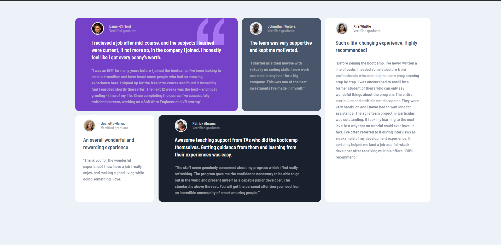

# Testimonials-Grid-Section

challenge from front end mentor. Testimonial Grid Section.

link to project: https://naser23.github.io/Testimonials-Grid-Section/;

// SCREENSHOTS OF PROJECT //

// Desktop Version //

// Mobile Version //

;

// OVERVIEW //

I built this with html, and scss/css. second project with sass but this is my first project with grid and it turned out pretty well. I still need some work with grid though.
